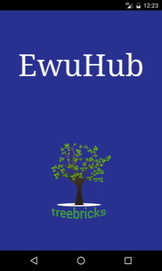
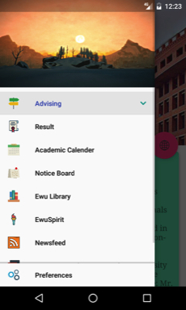
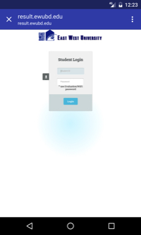
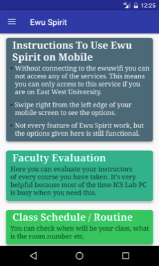
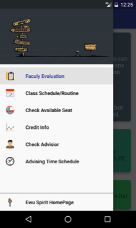

# EwuHub
 

##### Play Store

EwuHub is an Android application for East West University, Bangladesh. This application is can be useful for the student of EWU.
By this application they can sort their subjects for advising without any conflict. 
They can also see their result, notices, routine(EwSpirit), evaluation(EwSpirit) and other thing which is useful to them. We hope this application will help EWUians.

### App Intro
 

### Application Home
  

### Application Features
   

### EwSpirit
 

License
=======

    Copyright 2016 Md. Fahim Shahrier Rasel

    Licensed under the Apache License, Version 2.0 (the "License");
    you may not use this file except in compliance with the License.
    You may obtain a copy of the License at

       http://www.apache.org/licenses/LICENSE-2.0

    Unless required by applicable law or agreed to in writing, software
    distributed under the License is distributed on an "AS IS" BASIS,
    WITHOUT WARRANTIES OR CONDITIONS OF ANY KIND, either express or implied.
    See the License for the specific language governing permissions and
    limitations under the License.
